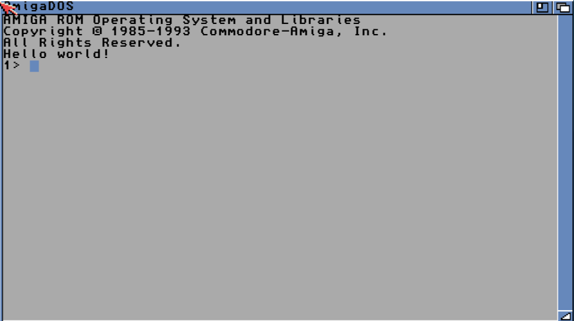

# Containerfile for AmigaOS Cross-Compiler Toolchain

`Containerfile` for [Stefan "Bebbo" Franke](https://github.com/bebbo)'s [amiga-gcc](https://github.com/bebbo/amiga-gcc) toolchain for Linux/AmigaOS cross-development.

This container is based on work by Sebastian Bergmann: [Docker Hub](https://hub.docker.com/r/sebastianbergmann/amiga-gcc/).

A ready-to-use image built from this Containerfile is available on [Docker Hub](https://hub.docker.com/r/liv2/amiga-gcc/). It is built as a multi-arch image, with images provided for both `amd64` and `arm64`.

More information can be found [here](https://amiga.sebastian-bergmann.de/presentations/2017/evoke/amiga-software-development-in-2017).

## What's included

In addition to Bebbo's amiga-gcc toolchain, the image also includes:

- **VBCC**, configured with the m68k-amigaos target and the Amiga NDK 3.2 (`$NDK32`)
- **[amitools](https://github.com/cnvogelg/amitools)**, including `vamos` for running AmigaOS binaries without an emulator
- **[Salvador](https://github.com/emmanuel-marty/salvador)**, a ZX0 compressor
- General development tools: `git`, `vim`, `curl`, `wget`, `python3`, `file`, `lhasa`, `srecord`, and `build-essential`

## "Hello world!" Example

### AmigaOS C API

`hello.c` from [Radosław Kujawa](https://github.com/Sakura-IT/Amiga-programming-examples/tree/master/C/hello-world-amiga):

```c
#include <proto/exec.h>
#include <proto/dos.h>

int main(int argc, void *argv[])
{
    struct Library *SysBase;
    struct Library *DOSBase;

    SysBase = *((struct Library **)4UL);
    DOSBase = OpenLibrary("dos.library", 0);

    if (DOSBase) {
        Write(Output(), "Hello world!\n", 13);
        CloseLibrary(DOSBase);
    }

    return(0);
}
```


### Standard C Library

`hello.c` from [Radosław Kujawa](https://github.com/Sakura-IT/Amiga-programming-examples/tree/master/C/hello-world):

```c
#include <stdio.h>

int main()
{
    printf("Hello world!\n");

    return(0);
}
```


### Compilation

```
$ podman run -v $HOME:/host -it liv2/amiga-gcc \
  m68k-amigaos-gcc /host/hello.c -o /host/hello -noixemul
```


### Execution

#### Container-ized Emulation using FS-UAE

The `docker-execute-amiga` script used below can be downloaded from [here](https://raw.githubusercontent.com/sebastianbergmann/docker-execute-amiga/master/docker-execute-amiga.sh).

```
$ docker-execute-amiga helloworld
```




#### Container-ized Emulation using Virtual AmigaOS (vamos)

```
$ podman run -v $HOME:/host liv2/amiga-gcc \
  vamos -C 68020 /host/hello
Hello world!
```

